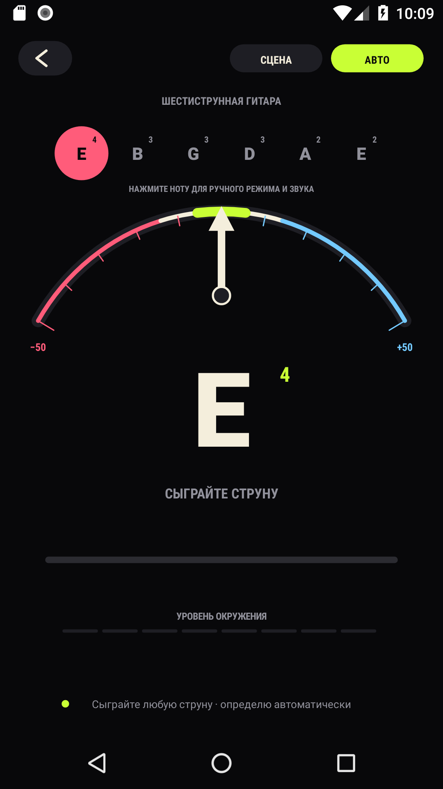
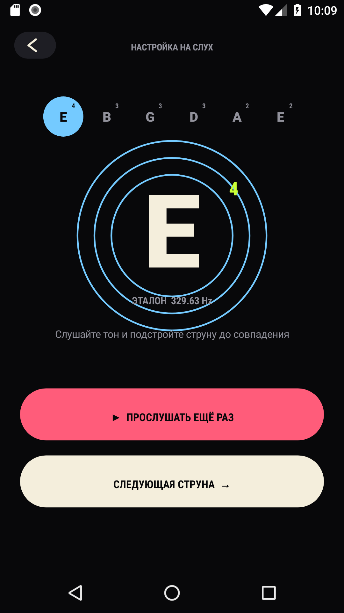

<div align="center">
  

  # В ТОН

  **Простой и точный тюнер для гитары и укулеле**

  Работает без интернета · Не требует регистрации · Весит меньше 1 МБ

  [](https://developer.android.com/about/versions/marshmallow)
  [](https://github.com/Sadsadhead/v-ton-android/releases/latest)
  [](#приватность)

  ## [⬇️ Скачать В ТОН для Android](https://github.com/Sadsadhead/v-ton-android/releases/latest/download/v-ton.apk)

  [Последний релиз](https://github.com/Sadsadhead/v-ton-android/releases/latest) · [Все версии](https://github.com/Sadsadhead/v-ton-android/releases)
</div>

---

«В ТОН» слышит инструмент через микрофон и сразу показывает, куда подкрутить струну. Подходит для шестиструнной гитары и укулеле — дома, на репетиции или прямо перед выступлением.

## Как это работает

| 1. Выберите инструмент | 2. Сыграйте струну | 3. Попадите в центр |
|:---:|:---:|:---:|
|  |  | Стрелка слева — струна звучит **ниже**.<br><br>Стрелка справа — струна звучит **выше**.<br><br>Стрелка по центру — **готово!** |

1. Выберите **6 струн** или **укулеле**.
2. Нажмите **«Приступить»** и разрешите доступ к микрофону.
3. Сыграйте одну открытую струну — приложение определит её автоматически.
4. Подтягивайте или ослабляйте струну, пока стрелка не окажется по центру.

> Лучше настраиваться в тихом месте и играть только по одной струне.

### Настройка на слух

Если микрофон использовать неудобно, нажмите **«Настроить на слух»**. Приложение воспроизведёт эталонный звук каждой струны — останется настроить инструмент до совпадения.

<p align="center">
  
</p>

## Что умеет

- гитара **E–A–D–G–B–E** и укулеле **G–C–E–A**;
- автоматический и ручной выбор струны;
- точная шкала отклонения от ноты;
- эталонный звук для настройки на слух;
- контрастный сценический режим;
- полностью автономная работа без рекламы и сети.

## Установка

1. **[Скачайте `v-ton.apk`](https://github.com/Sadsadhead/v-ton-android/releases/latest/download/v-ton.apk)**.
2. Откройте файл на телефоне и разрешите установку из этого источника, если Android попросит.
3. Запустите «В ТОН» и предоставьте доступ к микрофону.

Готовый APK также лежит в корне репозитория: [`В-ТОН.apk`](https://github.com/Sadsadhead/v-ton-android/raw/main/%D0%92-%D0%A2%D0%9E%D0%9D.apk).

```text
SHA-256: 5c40a2699735134d514a1d42333b4220218f24e929dc40268ef601ecea3becfa
```

## Сборка

```bash
./gradlew assembleDebug
```

Готовый файл появится в `app/build/outputs/apk/debug/app-debug.apk`.

## Приватность

Приложение использует микрофон только для определения ноты. Звук обрабатывается на устройстве и никуда не отправляется — разрешение на доступ к интернету отсутствует.

---

<p align="center"><strong>Настраивайтесь быстро. Играйте в тон. 🎸</strong></p>
